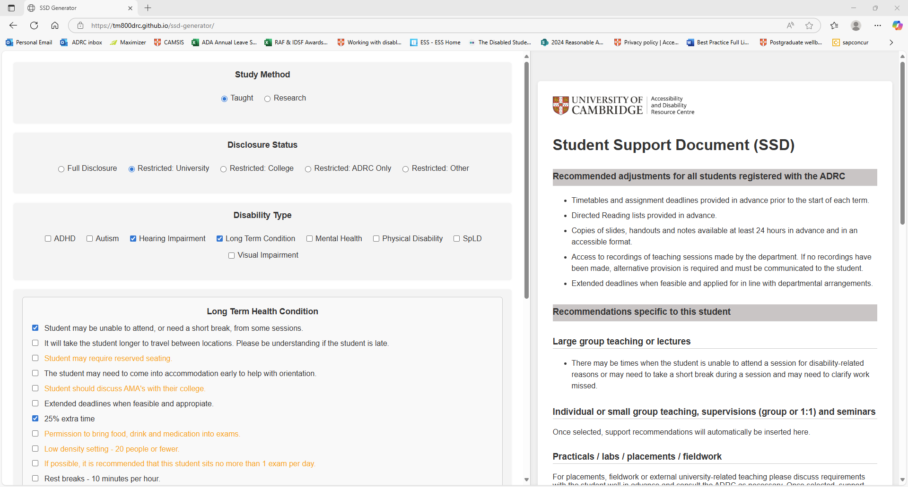
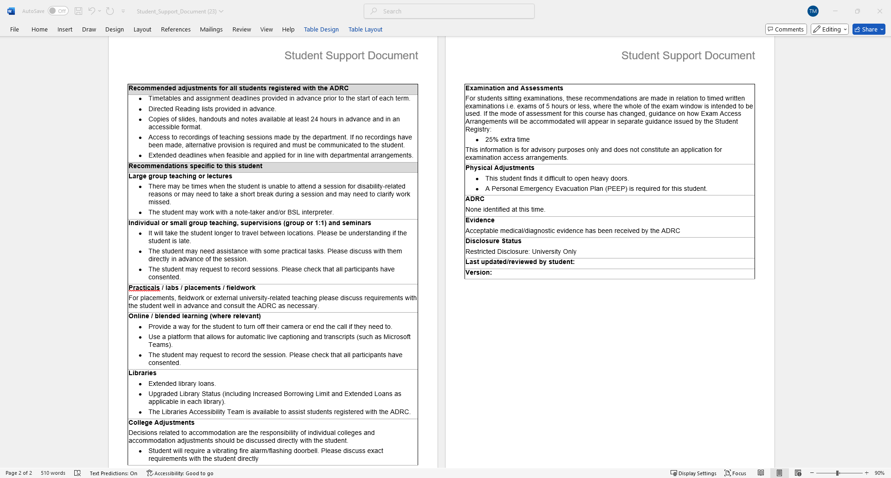

# Student Support Document Generator (SSD Generator)

A web-based tool designed to automate and streamline the creation of Student Support Documents (SSDs) for university disability services.

# Project Overview
Student Support Documents (SSDs) were previously created manually, requiring advisers to repeatedly input structured adjustments for each student case. This process was time-consuming, inconsistent, and prone to duplication errors, particularly for students with complex or multiple support needs.

This project introduces a rule-based document generation system that streamlines workflow, reduces manual input, and improves consistency across outputs.

# Context
This project was developed independently as a response to a real operational need within a university accessibility service environment.

This project is a portfolio-adapted version of a tool developed for use in a university accessibility service environment.

---

## Live Demo

[View the live site](https://theamurray.github.io/ssd-builder)

---

## Key Impact

- Reduced average document creation time from **4m 26s** to **1m 53s (61% reduction)**
- Eliminated manual duplication errors through rule-based logic
- Standardised document structure across all outputs
- Reduced administrative workload, allowing advisers to focus on higher-complexity cases

## Features

- Rule-based filtering system based on study mode and disability type
- Dynamic adjustment of available support options 
- Live structured document preview generation
- State-based validation preventing duplicate or conflicting selections
- Structured output formatting (headings, bullet points)
- Accessibility-focused UI design for non-technical users
- Fully client-side: No data is saved or transmitted. The program is fully GDPR compliant.

---

## Metrics and Evaluation
- Reduced document creation time from **4 minutes 26 seconds to 1 minute 53 seconds (61% improvement)**
- Reduced duplication and formatting inconsistencies through structured logic rules
- Improved consistency of output across multiple advisers and cases
- Reduced cognitive load for non-technical users through simplified interface design

## What I learned
- Designing rule-based systems for real-world administrative workflows
- Translating complex user requirements into structured logic
- Balancing automation with human decision-making
- Building user-friendly tools for non-technical professional environments

## Future Improvements
- Integration with database for stored templates
- Role-based access control for different user types
- Analytics dashboard to track usage patterns and efficiency gains

---

## Screenshots

Main interface with options selected:



Example of generated Word document:



---


## Tech Stack (portfolio version)

Frontend: HTML5, CSS3, JS
Hosting: Github Pages

## Running Locally

To run the project locally, use the following commands:

```
git clone https://github.com/theamurray/ssd-generator.git
cd ssd-generator
npm install
npm run dev
```

Then open http://localhost:5173 in your browser.

To build for production:

```
npm run build
```

## Folder Structure

```plaintext
ssd-generator/
│
├── index.html             # Main HTML structure
├── vite.config.js         # Vite configuration for GitHub Pages
├── public/                # Static assets
├── src/
│   ├── main.js            # Entry point
│   ├── script.js          # UI rendering and state handling
│   ├── docGenerator.js    # Word document export logic using docx
│   ├── layouts.js         # Layout templates
│   ├── supportOptions.js  # All support option definitions
│   ├── disclosureLevels.js
│   └── style.css         # Custom styling
```

## License

This project is shared for portfolio demonstration purposes only. The code is not intended for reuse or redistribution.

## Acknowledgements

- The docx npm library (https://www.npmjs.com/package/docx) for enabling Word document generation in-browser
- University colleagues for their feedback and encouragement during development
